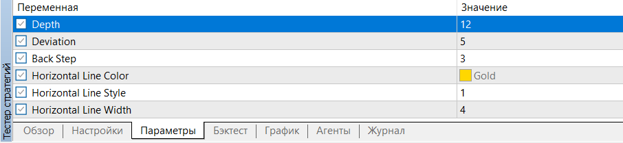
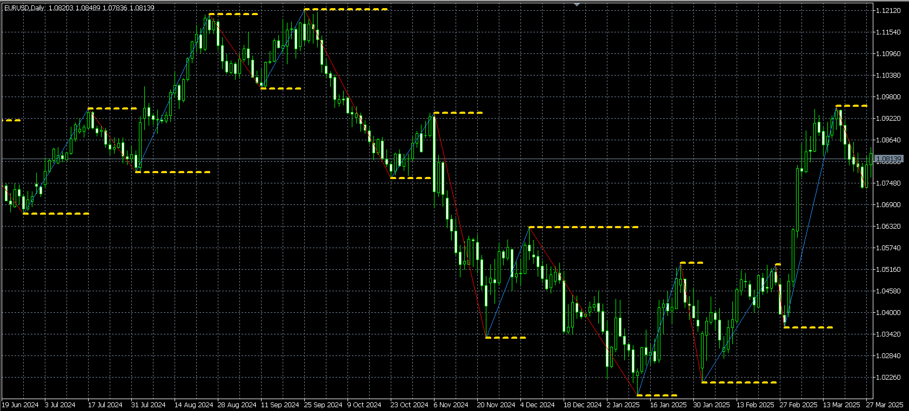

# 📊 AlgoTradingSolutions  
**Automated Trading Development Kit for MetaTrader 5 (MQL5)**  

A toolkit for developing automated trading systems on the MetaTrader 5 platform. Includes scripts, indicators, and experts for market analysis and strategy implementation.

---

## 🔍 Key Features  
- **Horizontal Levels at Extremes**: Automatic drawing of support/resistance lines based on local price highs/lows.  
- **MetaTrader 5 Integration**: All files are compatible with MetaEditor and follow MQL5 standards.  
- **Customizable Parameters**: Flexible settings for adjusting behavior of indicators and scripts.  

---

## 📁 Repository Contents  

### 1. **[ZigzagColor.mq5](ZigzagColor.mq5)**  
Modified MetaQuotes indicator for visualizing trend direction with colored zigzag lines.  

**Features:**  
- Highlights key reversal points on the chart.  
- Distinct colors for uptrend (blue) and downtrend (red).  

---

### 2. **[AutoHLineExtremum.mq5](AutoHLineExtremum.mq5)**  
Script for drawing horizontal lines at price extremes.  

**Features:**  
- Detects local peaks and valleys using extremum detection algorithms.  
- Adjustable depth (`InpDepth`) and sensitivity (`InpDeviation`).  
- Customizable line color, width, and style via parameters.  

**Parameters:**  
```cpp
input int    InpDepth=15;       // Depth of extremum search  
input int    InpDeviation=5;    // Deviation for noise filtering  
input int    InpBackstep = 3;   // Back Step
input color  LineColor=clrGold; // Line color  
input int    LineWidth=2;       // Line thickness  
input ENUM_LINE_STYLE LineStyle=STYLE_DOT; // Line style 
```


## ⚙️ Script Parameters (AutoHLineExtremum)  
  
*Parameter configuration dialog in MetaEditor*

---

## 📈 Example Output  
  
*Real-time horizontal lines at price extremes*

---

## 🔧 Added Features in Modified Files  

### Horizontal Line Drawing Logic  
The original `ZigzagColor.mq5` file from MetaQuotes has been enhanced with the following functionality:

- **Function: `DrawHorizontalLines`**
- **Function: `ObjectLine`**

## Key Enhancements  
- **Automated Level Detection**:  
  - Identifies local min/max using `ZigzagBottomBuffer` and `ZigzagPeakBuffer`.  
  - Dynamically resizes arrays to store extremum timestamps and prices.  
- **Visual Feedback**:  
  - Draws horizontal trendlines (`OBJ_TREND`) between consecutive extremum points.  
  - Supports customization of line color, style, and width via script parameters.  
- **Data Logging**:  
  - Records extremum timestamps and price values to a file for further analysis.  


---

## 🛠️ Installation  
1. Clone the repository into your MetaTrader 5 `MQL5` folder:  
    ```bash  
    git clone https://github.com/yourusername/AlgoTradingSolutions.git  
    ```
2. Restart MetaEditor.
3. Find scripts/indicators in Navigator → Custom Scripts/Indicators

### 🧠 Tip  
Use the **Strategy Tester** in MetaTrader 5 for testing scripts. 

---

## 📌 Acknowledgments  
- MetaQuotes Software Corp. for original source files.  
- MQL5 community for feedback and testing.  

---

## 📝 License  
Original MetaQuotes files are licensed under the [MetaQuotes EULA](https://www.metaquotes.net/en/legal/eula).  
Modifications and new files (e.g., `AutoHLineExtremum.mq5`) are available under the MIT License.  

---

## 💬 Contribution  
Bug reports, feature requests, and pull requests are welcome.  

---

### 🌐 Links  
- MetaTrader 5: [https://www.metatrader5.com](https://www.metatrader5.com)  
- MQL5 Documentation: [https://www.mql5.com/en/docs](https://www.mql5.com/en/docs)  

---

### 📂 Repository Structure  

```
AlgoTradingSolutions/  
├── AutoHLineExtremum.mq5      // Script for extremum-based horizontal lines  
├── ZigzagColor.mq5            // Colored ZigZag indicator (MetaQuotes)  
├── img/                       // Documentation images  
│   ├── params.png  
│   └── HLines.png  
└── README.md                  // This documentation  
```

### 🏷️ Tags  
#MQL5 #MetaTrader5 #AlgorithmicTrading #TradingBot #AutoHLine #ZigZag  

---